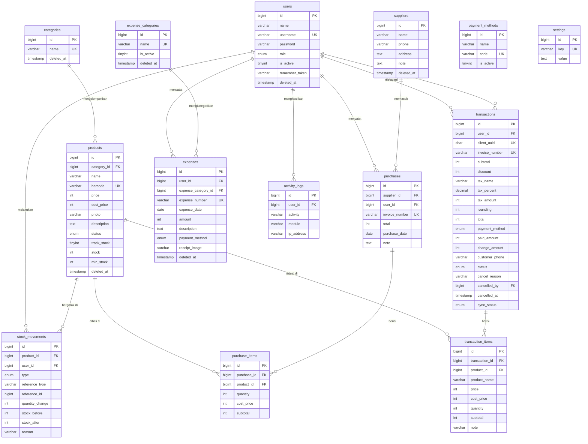

# Database Design — Pitou Cafe POS v1.0

| | |
|---|---|
| **Aplikasi** | Pitou Cafe POS |
| **Versi Skema** | 1.0 (mengikuti PRD v1.0 Final) |
| **DBMS** | MySQL 8.x |
| **Engine** | InnoDB (wajib — untuk FK & transaction) |
| **Charset** | utf8mb4 / utf8mb4_unicode_ci |
| **Tanggal** | 15 Juli 2026 |

---

## 1. Konvensi

- **Primary key:** `id` — `BIGINT UNSIGNED AUTO_INCREMENT` (default Laravel).
- **Uang (Rupiah):** disimpan sebagai **`INT UNSIGNED`** (tanpa desimal). Cukup untuk UMKM (maks ± Rp 4,29 miliar per kolom).
- **Timestamps:** `created_at`, `updated_at` (`TIMESTAMP NULL`).
- **Soft delete:** kolom `deleted_at` (`TIMESTAMP NULL`) — hanya pada tabel tertentu (lihat Bab 6).
- **Boolean:** `TINYINT(1)`.
- **UUID:** `CHAR(36)` untuk `client_uuid` (dedup offline sync).
- **Nama tabel:** jamak & snake_case; FK: `{tabel_tunggal}_id`.

---

## 2. Entity Relationship Diagram (ERD)



---

## 3. Spesifikasi Tabel

### 3.1 `users`
| Kolom | Tipe | Null | Default | Keterangan |
|---|---|---|---|---|
| id | BIGINT UNSIGNED | ❌ | AI | PK |
| name | VARCHAR(100) | ❌ | | Nama lengkap |
| username | VARCHAR(50) | ❌ | | **UNIQUE**, untuk login |
| password | VARCHAR(255) | ❌ | | Hash bcrypt |
| role | ENUM('owner','admin','kasir') | ❌ | 'kasir' | Role RBAC |
| is_active | TINYINT(1) | ❌ | 1 | User nonaktif tak bisa login |
| remember_token | VARCHAR(100) | ✅ | NULL | Remember Me |
| deleted_at | TIMESTAMP | ✅ | NULL | **Soft delete** |
| created_at / updated_at | TIMESTAMP | ✅ | NULL | |

**Index:** UNIQUE(`username`), INDEX(`role`), INDEX(`is_active`)

---

### 3.2 `categories`
| Kolom | Tipe | Null | Default | Keterangan |
|---|---|---|---|---|
| id | BIGINT UNSIGNED | ❌ | AI | PK |
| name | VARCHAR(50) | ❌ | | **UNIQUE** |
| deleted_at | TIMESTAMP | ✅ | NULL | **Soft delete** |
| timestamps | | | | |

**Index:** UNIQUE(`name`)

---

### 3.3 `products`
| Kolom | Tipe | Null | Default | Keterangan |
|---|---|---|---|---|
| id | BIGINT UNSIGNED | ❌ | AI | PK |
| category_id | BIGINT UNSIGNED | ❌ | | FK → categories |
| name | VARCHAR(100) | ❌ | | |
| barcode | VARCHAR(50) | ✅ | NULL | **UNIQUE jika diisi**, opsional (future use) |
| price | INT UNSIGNED | ❌ | | Harga jual (Rupiah) |
| cost_price | INT UNSIGNED | ✅ | NULL | Harga modal — auto dari pembelian |
| photo | VARCHAR(255) | ✅ | NULL | Path file |
| description | TEXT | ✅ | NULL | |
| status | ENUM('aktif','habis') | ❌ | 'aktif' | |
| track_stock | TINYINT(1) | ❌ | 0 | Kelola stok |
| stock | INT | ❌ | 0 | Sisa stok |
| min_stock | INT | ❌ | 0 | Batas peringatan |
| deleted_at | TIMESTAMP | ✅ | NULL | **Soft delete** |
| timestamps | | | | |

**Index:** FK(`category_id`) → RESTRICT, UNIQUE(`barcode`), INDEX(`status`), INDEX(`category_id`)

---

### 3.4 `suppliers`
| Kolom | Tipe | Null | Default | Keterangan |
|---|---|---|---|---|
| id | BIGINT UNSIGNED | ❌ | AI | PK |
| name | VARCHAR(100) | ❌ | | |
| phone | VARCHAR(20) | ✅ | NULL | |
| address | TEXT | ✅ | NULL | |
| note | TEXT | ✅ | NULL | |
| deleted_at | TIMESTAMP | ✅ | NULL | **Soft delete** |
| timestamps | | | | |

**Index:** INDEX(`name`)

---

### 3.5 `purchases`
| Kolom | Tipe | Null | Default | Keterangan |
|---|---|---|---|---|
| id | BIGINT UNSIGNED | ❌ | AI | PK |
| supplier_id | BIGINT UNSIGNED | ❌ | | FK → suppliers |
| user_id | BIGINT UNSIGNED | ❌ | | FK → users (pencatat) |
| invoice_number | VARCHAR(30) | ❌ | | **UNIQUE**, `PUR-YYYYMMDD-0001` |
| total | INT UNSIGNED | ❌ | | Total pembelian |
| purchase_date | DATE | ❌ | | |
| note | TEXT | ✅ | NULL | |
| timestamps | | | | |

**Index:** UNIQUE(`invoice_number`), FK(`supplier_id`) → RESTRICT, FK(`user_id`) → RESTRICT, INDEX(`purchase_date`)

---

### 3.6 `purchase_items`
| Kolom | Tipe | Null | Default | Keterangan |
|---|---|---|---|---|
| id | BIGINT UNSIGNED | ❌ | AI | PK |
| purchase_id | BIGINT UNSIGNED | ❌ | | FK → purchases (**CASCADE**) |
| product_id | BIGINT UNSIGNED | ❌ | | FK → products (RESTRICT) |
| quantity | INT UNSIGNED | ❌ | | |
| cost_price | INT UNSIGNED | ❌ | | Harga beli satuan |
| subtotal | INT UNSIGNED | ❌ | | quantity × cost_price |
| timestamps | | | | |

**Index:** FK(`purchase_id`) → CASCADE, FK(`product_id`) → RESTRICT

---

### 3.7 `stock_movements`
| Kolom | Tipe | Null | Default | Keterangan |
|---|---|---|---|---|
| id | BIGINT UNSIGNED | ❌ | AI | PK |
| product_id | BIGINT UNSIGNED | ❌ | | FK → products |
| user_id | BIGINT UNSIGNED | ❌ | | FK → users |
| type | ENUM('sale','purchase','adjustment') | ❌ | | Jenis pergerakan |
| reference_type | VARCHAR(50) | ✅ | NULL | Nama sumber (polymorphic ringan) |
| reference_id | BIGINT UNSIGNED | ✅ | NULL | ID sumber (transaksi/pembelian) |
| quantity_change | INT | ❌ | | Bisa **negatif** (penjualan) / positif (pembelian) |
| stock_before | INT | ❌ | | Stok sebelum |
| stock_after | INT | ❌ | | Stok sesudah |
| reason | VARCHAR(255) | ✅ | NULL | Alasan (rusak/hilang/koreksi/cancel) |
| timestamps | | | | |

**Index:** FK(`product_id`) → RESTRICT, FK(`user_id`) → RESTRICT, INDEX(`type`), INDEX(`reference_type`,`reference_id`), INDEX(`created_at`)

> Tabel append-only (tidak di-soft-delete, tidak diedit).

---

### 3.8 `transactions`
| Kolom | Tipe | Null | Default | Keterangan |
|---|---|---|---|---|
| id | BIGINT UNSIGNED | ❌ | AI | PK |
| user_id | BIGINT UNSIGNED | ❌ | | FK → users (kasir) |
| client_uuid | CHAR(36) | ❌ | | **UNIQUE** — dedup offline sync |
| invoice_number | VARCHAR(30) | ❌ | | **UNIQUE**, `TRX-YYYYMMDD-0001` |
| subtotal | INT UNSIGNED | ❌ | | Sebelum diskon & pajak |
| discount | INT UNSIGNED | ❌ | 0 | |
| tax_name | VARCHAR(50) | ✅ | NULL | **Snapshot** |
| tax_percent | DECIMAL(5,2) | ❌ | 0.00 | **Snapshot** |
| tax_amount | INT UNSIGNED | ❌ | 0 | **Snapshot** |
| rounding | INT | ❌ | 0 | Nilai pembulatan (bisa +/−) |
| total | INT UNSIGNED | ❌ | | Total akhir |
| payment_method | ENUM('tunai','qris','transfer','kartu') | ❌ | | |
| paid_amount | INT UNSIGNED | ✅ | NULL | Uang pelanggan (tunai) |
| change_amount | INT UNSIGNED | ✅ | NULL | Kembalian |
| customer_phone | VARCHAR(20) | ✅ | NULL | Untuk struk WhatsApp |
| status | ENUM('paid','cancelled') | ❌ | 'paid' | Status transaksi |
| cancel_reason | VARCHAR(255) | ✅ | NULL | Wajib saat dibatalkan |
| cancelled_by | BIGINT UNSIGNED | ✅ | NULL | FK → users (Owner) |
| cancelled_at | TIMESTAMP | ✅ | NULL | |
| sync_status | ENUM('synced','pending') | ❌ | 'synced' | Status sinkronisasi |
| timestamps | | | | |

**Index:** UNIQUE(`invoice_number`), UNIQUE(`client_uuid`), FK(`user_id`) → RESTRICT, FK(`cancelled_by`) → RESTRICT, INDEX(`status`), INDEX(`payment_method`), INDEX(`sync_status`), INDEX(`created_at`)

> Immutable — tidak di-soft-delete. Koreksi hanya lewat `status = cancelled`.

---

### 3.9 `transaction_items`
| Kolom | Tipe | Null | Default | Keterangan |
|---|---|---|---|---|
| id | BIGINT UNSIGNED | ❌ | AI | PK |
| transaction_id | BIGINT UNSIGNED | ❌ | | FK → transactions (**CASCADE**) |
| product_id | BIGINT UNSIGNED | ❌ | | FK → products (RESTRICT) |
| product_name | VARCHAR(100) | ❌ | | **Snapshot** nama |
| price | INT UNSIGNED | ❌ | | **Snapshot** harga jual |
| cost_price | INT UNSIGNED | ✅ | NULL | **Snapshot** harga modal (untuk laba) |
| quantity | INT UNSIGNED | ❌ | | |
| subtotal | INT UNSIGNED | ❌ | | price × quantity |
| note | VARCHAR(255) | ✅ | NULL | Catatan pesanan |
| timestamps | | | | |

**Index:** FK(`transaction_id`) → CASCADE, FK(`product_id`) → RESTRICT

---

### 3.10 `expense_categories`
| Kolom | Tipe | Null | Default | Keterangan |
|---|---|---|---|---|
| id | BIGINT UNSIGNED | ❌ | AI | PK |
| name | VARCHAR(50) | ❌ | | **UNIQUE** |
| is_active | TINYINT(1) | ❌ | 1 | |
| deleted_at | TIMESTAMP | ✅ | NULL | **Soft delete** |
| timestamps | | | | |

**Index:** UNIQUE(`name`), INDEX(`is_active`)

---

### 3.11 `expenses`
| Kolom | Tipe | Null | Default | Keterangan |
|---|---|---|---|---|
| id | BIGINT UNSIGNED | ❌ | AI | PK |
| user_id | BIGINT UNSIGNED | ❌ | | FK → users (pencatat) |
| expense_category_id | BIGINT UNSIGNED | ❌ | | FK → expense_categories |
| expense_number | VARCHAR(30) | ❌ | | **UNIQUE**, `EXP-YYYYMMDD-0001` |
| expense_date | DATE | ❌ | | |
| amount | INT UNSIGNED | ❌ | | Harus > 0 (validasi app) |
| description | TEXT | ✅ | NULL | |
| payment_method | ENUM('tunai','qris','transfer','kartu') | ❌ | | |
| receipt_image | VARCHAR(255) | ✅ | NULL | Foto bukti (opsional) |
| deleted_at | TIMESTAMP | ✅ | NULL | **Soft delete** |
| timestamps | | | | |

**Index:** UNIQUE(`expense_number`), FK(`user_id`) → RESTRICT, FK(`expense_category_id`) → RESTRICT, INDEX(`expense_date`)

---

### 3.12 `payment_methods`
| Kolom | Tipe | Null | Default | Keterangan |
|---|---|---|---|---|
| id | BIGINT UNSIGNED | ❌ | AI | PK |
| name | VARCHAR(50) | ❌ | | Label tampil |
| code | VARCHAR(20) | ❌ | | **UNIQUE** — `tunai`/`qris`/`transfer`/`kartu` |
| is_active | TINYINT(1) | ❌ | 1 | |
| timestamps | | | | |

**Index:** UNIQUE(`code`), INDEX(`is_active`)

---

### 3.13 `settings`
| Kolom | Tipe | Null | Default | Keterangan |
|---|---|---|---|---|
| id | BIGINT UNSIGNED | ❌ | AI | PK |
| key | VARCHAR(50) | ❌ | | **UNIQUE** |
| value | TEXT | ✅ | NULL | |
| timestamps | | | | |

**Index:** UNIQUE(`key`)

**Key yang disimpan (Profil Toko + Pajak):** `store_name` (default *Pitou Cafe*), `store_logo`, `store_address`, `store_phone`, `store_email`, `store_instagram`, `receipt_footer`, `tax_enabled`, `tax_name`, `tax_percent`, `rounding_method`.

---

### 3.14 `activity_logs`
| Kolom | Tipe | Null | Default | Keterangan |
|---|---|---|---|---|
| id | BIGINT UNSIGNED | ❌ | AI | PK |
| user_id | BIGINT UNSIGNED | ❌ | | FK → users |
| activity | VARCHAR(255) | ❌ | | Deskripsi aksi |
| module | VARCHAR(50) | ❌ | | Produk/Pengeluaran/Pengaturan/User/Transaksi/Auth |
| ip_address | VARCHAR(45) | ✅ | NULL | Opsional (IPv4/IPv6) |
| timestamps | | | | |

**Index:** FK(`user_id`) → RESTRICT, INDEX(`module`), INDEX(`created_at`)

> Append-only. Hanya Owner yang bisa melihat (dijaga di layer aplikasi).

---

## 4. Ringkasan Relasi & Aksi FK

| Child | Parent | On Delete | Alasan |
|---|---|---|---|
| products | categories | **RESTRICT** | Kategori berisi produk tak boleh dihapus |
| purchases | suppliers | **RESTRICT** | Jaga histori pembelian |
| purchases | users | **RESTRICT** | Jaga jejak pencatat |
| purchase_items | purchases | **CASCADE** | Item ikut induk pembelian |
| purchase_items | products | **RESTRICT** | Produk dipakai histori → soft delete |
| stock_movements | products / users | **RESTRICT** | Log tak boleh putus |
| transactions | users (kasir) | **RESTRICT** | Jaga jejak kasir |
| transactions | users (cancelled_by) | **RESTRICT** / SET NULL | Jejak pembatal |
| transaction_items | transactions | **CASCADE** | Item ikut induk transaksi |
| transaction_items | products | **RESTRICT** | Snapshot menjaga histori |
| expenses | users | **RESTRICT** | Jejak pencatat |
| expenses | expense_categories | **RESTRICT** | Kategori terpakai tak boleh dihapus |
| activity_logs | users | **RESTRICT** | Audit tak boleh putus |

> Karena `transactions` bersifat immutable, CASCADE ke `transaction_items` praktis tidak terpicu di produksi — hanya jaring pengaman skema.

---

## 5. Snapshot (Anti-Korupsi Data)

Kolom snapshot menjaga akurasi histori meski master data berubah:

| Disimpan di | Kolom snapshot | Melindungi |
|---|---|---|
| transaction_items | `product_name`, `price`, `cost_price` | Riwayat & laba tetap akurat meski produk diedit / di-soft-delete |
| transactions | `tax_name`, `tax_percent`, `tax_amount`, `rounding` | Transaksi lama tak berubah saat pengaturan pajak diubah |

---

## 6. Kebijakan Soft Delete

**Pakai Soft Delete** (`deleted_at`):
`users`, `categories`, `products`, `suppliers`, `expense_categories`, `expenses`

**Tidak Soft Delete** (append-only / immutable):
`transactions`, `transaction_items`, `purchases`, `purchase_items`, `stock_movements`, `activity_logs`, `payment_methods`, `settings`

---

## 7. Referensi ENUM

| Tabel.Kolom | Nilai |
|---|---|
| users.role | `owner`, `admin`, `kasir` |
| products.status | `aktif`, `habis` |
| transactions.payment_method / expenses.payment_method | `tunai`, `qris`, `transfer`, `kartu` |
| transactions.status | `paid`, `cancelled` |
| transactions.sync_status | `synced`, `pending` |
| stock_movements.type | `sale`, `purchase`, `adjustment` |

---

## 8. Seed Data Awal

- **users:** 1 Owner default (username `owner`, password diganti saat pertama login).
- **payment_methods:** Tunai, QRIS, Transfer Bank, Kartu (Kartu default nonaktif).
- **expense_categories:** Listrik, Air, Internet/WiFi, Gaji Karyawan, Sewa, Perlengkapan Kebersihan, Transportasi, Lainnya.
- **settings:** `store_name = Pitou Cafe`, `tax_enabled = 0`, `tax_percent = 0`, `rounding_method = none`.

---

## 9. Urutan Migration (Dependency-Safe)

```
1.  users
2.  categories
3.  products               (FK: categories)
4.  suppliers
5.  purchases              (FK: suppliers, users)
6.  purchase_items         (FK: purchases, products)
7.  stock_movements        (FK: products, users)
8.  transactions           (FK: users)
9.  transaction_items      (FK: transactions, products)
10. expense_categories
11. expenses               (FK: users, expense_categories)
12. payment_methods
13. settings
14. activity_logs          (FK: users)
```

> Laravel: kolom FK dibuat sebagai `foreignId()->constrained()` dengan `->restrictOnDelete()` atau `->cascadeOnDelete()` sesuai Bab 4. Migration `transactions` perlu 2 FK ke `users` (`user_id` dan `cancelled_by`) — beri nama constraint eksplisit agar tidak bentrok.

---

## 10. Catatan Implementasi

- **Transaksi atomik:** pembuatan transaksi + pengurangan stok + `stock_movement` dibungkus `DB::transaction()` dengan `->lockForUpdate()` pada baris produk (cegah race condition & stok minus).
- **Pembatalan:** update `status`, `cancel_reason`, `cancelled_by`, `cancelled_at` + buat `stock_movement` tipe `adjustment` (kembalikan stok) — dalam satu DB transaction.
- **Auto number:** generate dalam DB transaction + andalkan UNIQUE index sebagai pengaman terakhir; jika bentrok, retry.
- **cost_price produk:** diperbarui dari `purchases` (harga beli terakhir atau rata-rata bergerak — pilih salah satu, konsisten).
- **Offline sync:** server menerima `client_uuid`; jika sudah ada → abaikan (idempotent).

---

*Database Design v1.0 — selaras dengan PRD v1.0 Final, siap diterjemahkan ke migration Laravel.*
